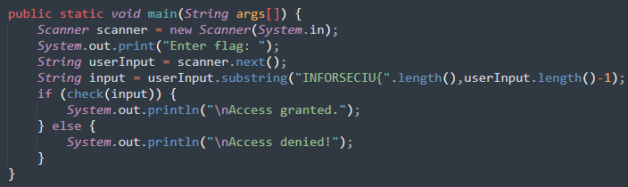
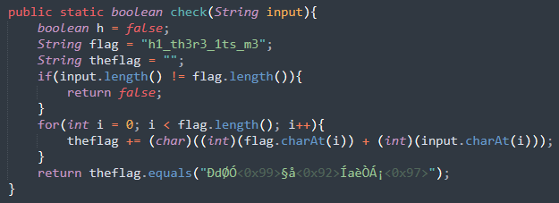
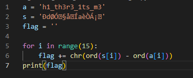

Bài này có sẵn source code luôn nên chỉ cần phân tích flow là được.

Đối vơi java và các ngôn ngữ như C/C++ thì cần phải có 1 hàm tên __main__ để làm **entry point** cho chương trình.

Hàm này dùng scanner để đọc giá trị nhập vào. Còn hàm __substring()__ dùng để tách chuỗi, với tham số đầu tiên là vị trí bắt đâu, và thứ 2 là vị trí kết thúc.

Sau đó đem chuỗi này vào hàm __check__

Đây cũng là một hàm cơ bản khi
* đầu tiên, kiểm tra độ dài của _input_ xem có bằng chuỗi 'flag' là "h1_th3r3_1ts_m3" hay không.
* Sau đó chạy từ đầu đến cuối, lấy kí tự tại vị trí i của _input_ và 'flag' để cộng với nhau ra _theflag_.
* Cuối cùng kiểm tra xem _theflag_ có bằng "ÐdØә§å’ÍaèÒÁ¡—" hay không. Bằng thì đó là flag chính xác.

Bài này cũng chỉ đơn giản là làm ngược lại quá trình thôi. 
* Tưởng tượng flag là x như bài tìm x với x + 7 = 15.
* `_input_ + "h1_th3r3_1ts_m3" = _theflag_`
* Thực hiện phép trừ (đổi ra giá trị ascii) là được.

Sponsor: Houseplant CTF 2020
