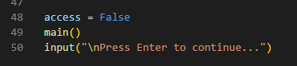
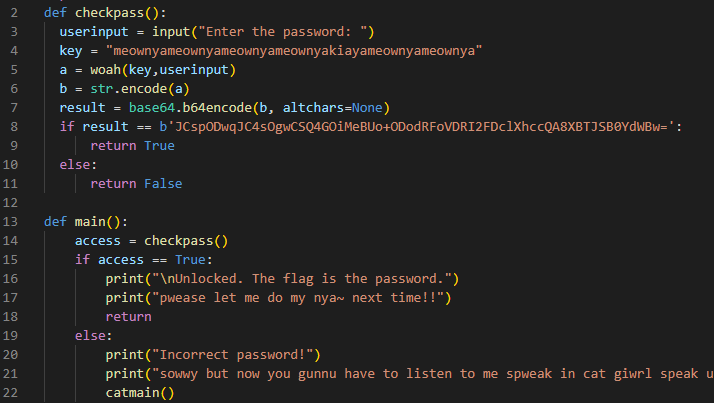
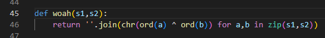
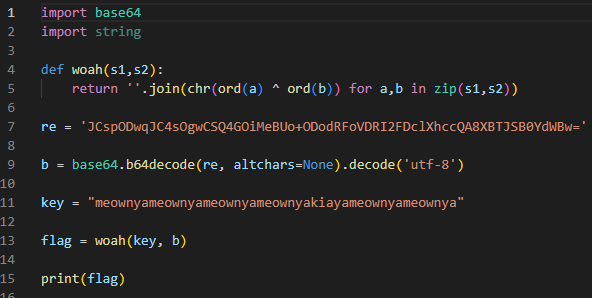

Bước đầu tiên, ta cần đưa nó về source code python, làm tương tự như bài [s1mple1](../s1mple1/README.md)

Thấy rằng hàm __main__ sẽ được gọi rồi tiếp đến là hàm __checkpass__



Tương tự sẽ check biến __access__ sau khi __checkpass__ được gọi và kiểm tra input từ người dùng.



Tại hàm __checkpass__ gọi đến hàm __woah__ với 2 tham số là __key__ và __userinput__. Hàm này sử dụng 2 chuỗi được đưa vào để tạo ra 1 chuỗi mới bằng cách sử dụng phép XOR. __chr__ convert từ giá trị ascii sang char. __ord__ thì ngược lại, từ char sang giá trị ascii.



Tách ra, nó như dưới:
```python
def woah(s1, s2)
    r = ''
    for i in range(len(s1)):
        a = s1[i]
        b = s2[i]
        r += chr(ord(a) ^ ord(b))
    return r
```

Sau đó là đem chuỗi này đi mã hóa (encode) với thuật toán base64.

woah(input, key) -> encode base64.

Để làm được bài này thì chỉ cần làm ngược lại các bước thôi. 

Vì base64 là chuỗi mã hóa đối xứng, decode sẽ ra chuỗi ban đầu. 

Phép XOR cũng có tính chất đối xứng: nếu biết A và C trong tập A ^ B = C thì sẽ tính được B = A ^ C




<sub><sup>Sponsor: Houseplant CTF 2020<sub><sup>
