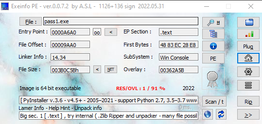
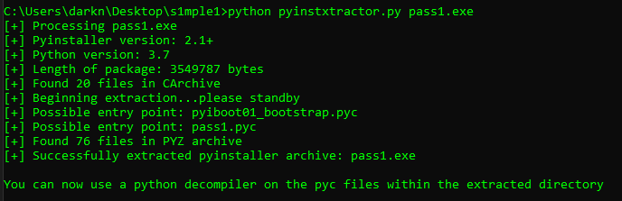
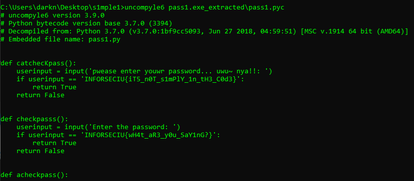
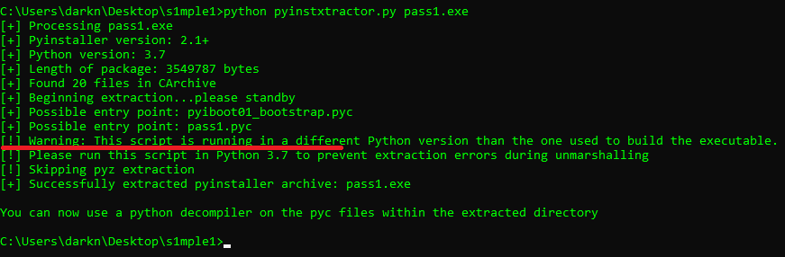
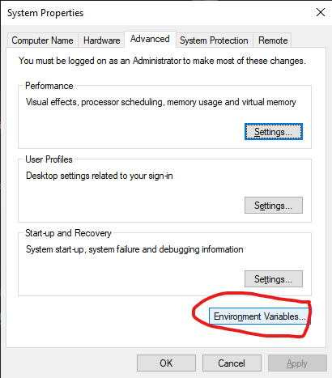
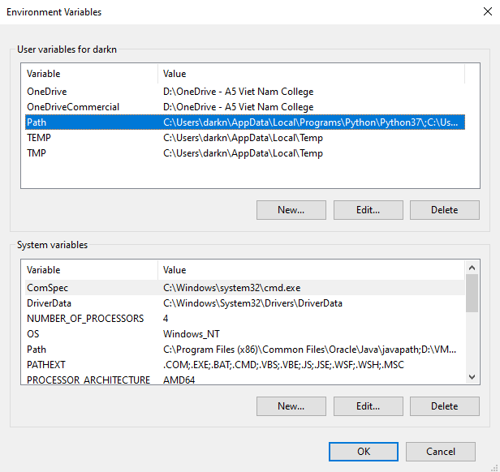
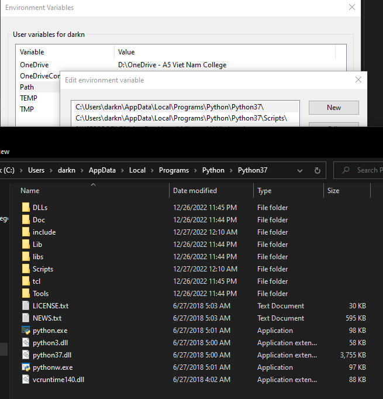
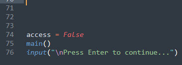
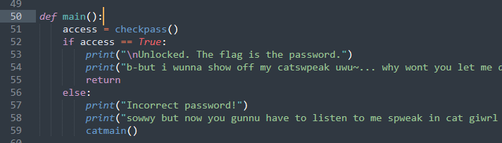
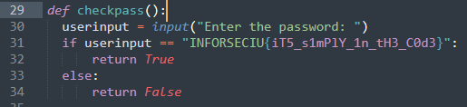

Mục đích của bài này là tập dịch ngược chương trình tạo từ python, đưa từ file thực thi về file source code.

Trong thực tế, để biết file executable được compile từ ngôn ngữ nào, là 32-bit hay 64-bit thì chúng ta có thể dùng 1 số PE Analyser để phát hiện. Ở đây mình dùng [Exeinfo PE](http://www.exeinfo.byethost18.com/)


Và đúng là trong bài này mình đã sử dụng câu lệnh dưới để compile từ .py sang .exe
```bash
pyinstaller --onefile pass1.py 
```

Về cơ bản, để có thể dịch ngược về code, ta cần 2 bước:

Đầu tiên là dùng [pyinstxtractor](https://github.com/extremecoders-re/pyinstxtractor)
```bash
python pyinstxtractor.py pass1.exe
```
để **unzip** từ .exe thành .pyc và các file lib đính kèm.


Sau đó dùng [uncompyle6](https://pypi.org/project/uncompyle6/) để chuyển từ file compile .pyc sang source code.
```bash
uncompyle6 pass1.exe_extracted\pass1.exe
```


- Câu lệnh cài pyinstaller
```bash
python -m pip install pyinstaller
```
- Câu lệnh cài uncompyle6
```bash
python -m pip install uncompyle6
```
- **Lưu ý** là ở đây chúng ta phải dùng phiên bản python chính xác với phiên bản python đã được sử dụng để compile (ở đây là 3.7.0) thì mới decompile đảm bảo đúng hoàn toàn được. Nếu phiên bản chúng ta đang dùng khác với phiên bản của compiler thì sẽ có cảnh báo như sau.

- Sau khi tìm được phiên bản python từ [trang chủ python](https://www.python.org/downloads/), chúng ta không cần xóa bản python đang xài hiện tại mà có thể cài luôn và tạm thời đổi môi trường cho CMD sang sử dụng bản python mới.
    * Tìm vị trí của python mới và thêm đường dẫn của nó vào phần PATH của môi trường máy tính.
    * Xóa đường dẫn môi trường của python cũ, làm xong bài thì sửa về lại ban đầu sau.
    * Sau khi xong thì OK để lưu và tắt toàn bộ cửa sổ cmd đang mở và mở lại thì mới có thể apply được môi trường mới vừa sửa.
    
    
    
    

Sau khi đã lấy được source code rồi thì bài này chỉ cần đọc và follow theo code để lấy được flag.

Tưởng tượng code là một dòng thác, chương trình sẽ thực thi các dòng lệnh từ trên xuống, trừ các câu lệnh tạo hàm (của python là _def_).

Ở đây thấy dòng 74 là dòng **đầu tiên** sát với lề trái nhất nên chương trình sẽ chạy từ đây xuống.

 

Gọi đến hàm _main_ (dòng 50)

 

hàm _main_ sẽ gọi đến hàm _checkpass_ và nhận giá trị trả về __access__, nếu giá trị __access__ có giá trị là `True` thì tức là pass đã nhập đúng, ngược lại không đúng sẽ gọi đến hàm __catmain__

Tại hàm __checkpass__, ta có thể thấy câu lệnh __input__ được dùng để nhập kí tự nhập vào từ bàn phím lưu vào __userinput__. Password mà nhập đúng là `INFORSECIU{iT5_s1mPlY_1n_tH3_C0d3}` thì sẽ trả về `True`, ngược lại là `False` cho biến __access__, unlocked.

 

__catmain__ cũng tương tự như __main__, mình không nhắc lại nữa.


<sub><sup>Sponsor: Houseplant CTF 2020<sub><sup>
