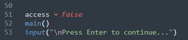
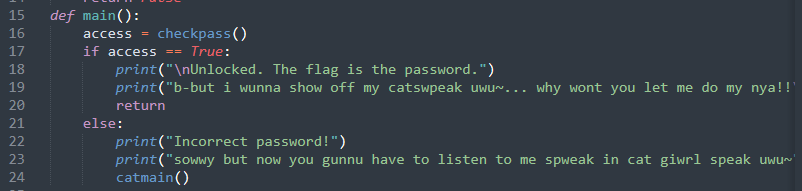
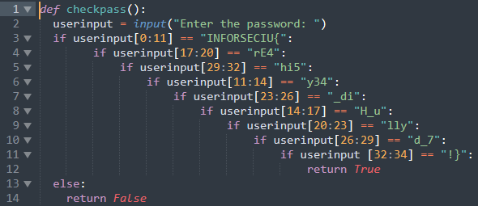
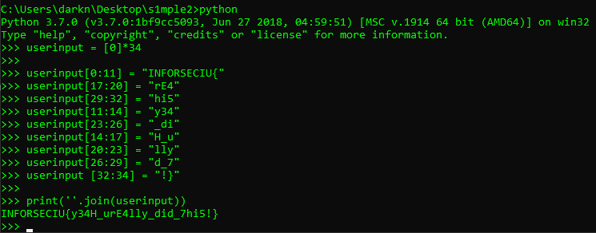
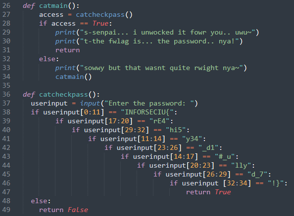

Bước đầu tiên, ta cần đưa nó về source code python, làm tương tự như bài [s1mple1](../s1mple1/README.md)

Sau khi đã có source code ta vẫn tiếp tục đọc code và phân tích luồng hoạt động của nó:

Thấy rằng hàm __main__ sẽ được gọi đầu tiên,



Tương tự sẽ check biến __access__ sau khi __checkpass__ được gọi và kiểm tra input từ người dùng.



Tuy vẫn nhập vào biến __userinput__ nhưng thuật toán kiểm tra đã có thay đổi.



Lần này không kiểm tra nguyên một chuỗi và tách ra kiểm tra từng chuỗi con (cách sử dụng chuỗi con của python đọc [tại đây](https://www.freecodecamp.org/news/how-to-substring-a-string-in-python/)). Nếu đúng toàn bộ chuỗi con thì giá trị trả về là `True`.

Đối với bài này có 2 cách làm như sau:

* Cách thứ nhất là làm tay, tìm chuỗi con theo thứ tự và copy paste các chuỗi đó nối với nhau ra flag.

* Cách thứ 2 là copy một số lệnh từ code gốc để máy nó nối giúp mình.

    

    * Tạo mảng có 34 phần từ, mỗi phần tử đều có giá trị ban đầu là 0.
    * Custom một chút các câu lệnh.
    * Sử dụng hàm có sẵn của python là [__join__](https://www.programiz.com/python-programming/methods/string/join) để nối các kí tự trong mảng lại với nhau.

Nếu password bị sai, chương trình sẽ chạy đến hàm __catmain__, cũng thực hiện nhiệm vụ tương tự như __main__ thôi, chỉ khác nhau ở flag.



Hai flag cho bài này là
```
INFORSECIU{y34H_urE4lly_did_7hi5!}

INFORSECIU{y34#_urE4lly_d1d_7hi5!}
```


<sub><sup>Sponsor: Houseplant CTF 2020<sub><sup>
