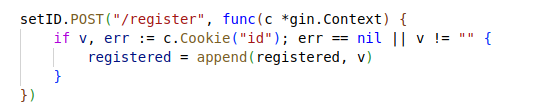

Đoạn code trên có tác dụng kiểm xem ID của user đã đăng ký hay chưa. Nếu đăng ký rồi thì flag sẽ được tự động gửi đến, còn không thì sẽ không nhận được gì.

Để đăng ký ID, chỉ cần truy cập vào endpoint `POST /register` và kèm theo ID dưới dạng cookie.

Sau đó, truy cập lại endpoint `GET /flag` (kèm theo ID đã đăng ký dưới dạng cookie) và đợi đến khi flag được gửi (20 giây mỗi lần gửi).

Note: Các bạn nên tìm hiểu về `goroutine` và `chanel` trong `golang` để hiểu rõ hơn về cơ chế hoạt động.

Flag: `INFORSECIU{SSE_with_golang_Rmze8CD8*@XLfGKM}`
