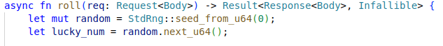

Số ngẫu nhiên không thực sự ngẫu nhiên vì nó được tạo ra dựa trên một số khác. Trong trường này là số `0` nên số ngẫu nhiên sẽ luôn cố định chứ không thay đổi. Giá trị của số ngẫu nhiên sẽ luôn luôn là `13486662071293341567`.

Flag: `INFORSECIU{random_wg6keU2y%+9jp@#n}`
